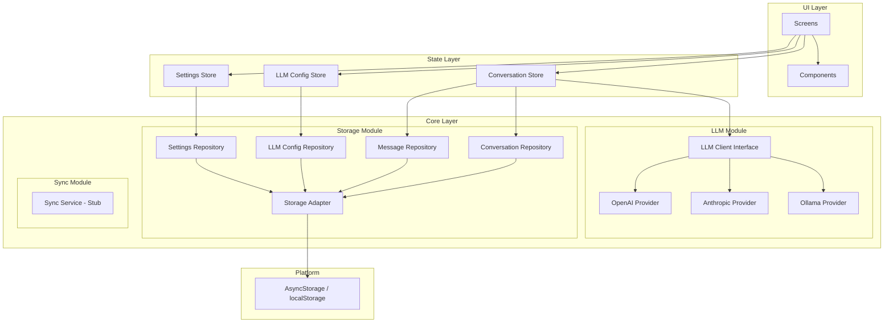
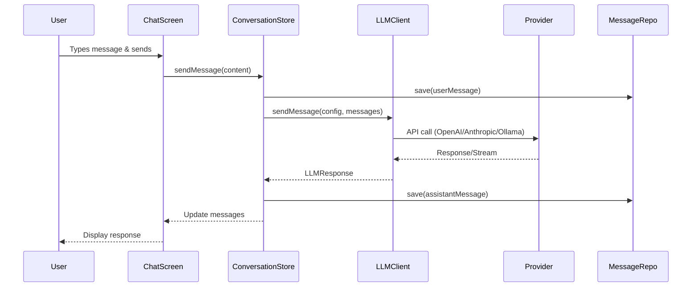
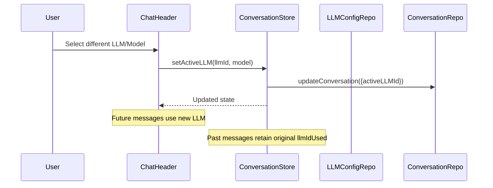

# LLM Hub - MVP Architecture Blueprint

> A cross-platform React Native app for chatting with multiple LLM providers (OpenAI, Anthropic, Ollama) with local conversation storage.

---

## 📐 High-Level Architecture



---

## 🔑 Core Design Principles

| Principle | Description |
|-----------|-------------|
| **Provider Agnostic** | UI never directly communicates with LLM APIs; all traffic goes through `LLMClient` interface |
| **Repository Pattern** | All data access abstracted via repository interfaces; storage implementation swappable |
| **Platform Abstraction** | Storage adapter handles platform differences (AsyncStorage on mobile, localStorage on web) |
| **Offline First** | All data stored locally; no network required except for LLM API calls |
| **Minimal State** | Zustand stores for reactive state; repositories for persistence |

---

## 🔄 Core Data Flow

### Chat Message Flow



### LLM Provider Selection Flow



---

## 📂 Folder Structure

```
/src
├── /core                          # Business logic layer
│   ├── /llm                       # LLM provider abstraction
│   │   ├── LLMClient.ts           # Main client interface & factory
│   │   ├── types.ts               # LLM-related TypeScript types
│   │   └── /providers
│   │       ├── BaseProvider.ts    # Abstract base provider
│   │       ├── OpenAIProvider.ts
│   │       ├── AnthropicProvider.ts
│   │       ├── OllamaProvider.ts
│   │       └── index.ts
│   │
│   ├── /storage                   # Local storage abstraction
│   │   ├── StorageAdapter.ts      # Platform-agnostic storage interface
│   │   ├── /repositories
│   │   │   ├── ConversationRepository.ts
│   │   │   ├── MessageRepository.ts
│   │   │   ├── LLMConfigRepository.ts
│   │   │   └── SettingsRepository.ts
│   │   └── index.ts
│   │
│   └── /sync                      # Future sync capability (stub)
│       └── SyncService.stub.ts
│
├── /state                         # State management (Zustand)
│   ├── conversationStore.ts
│   ├── llmStore.ts
│   ├── settingsStore.ts
│   └── index.ts
│
├── /ui                            # UI layer
│   ├── /screens
│   │   ├── ChatScreen.tsx
│   │   ├── ConversationListScreen.tsx
│   │   ├── SettingsScreen.tsx
│   │   ├── LLMManagementScreen.tsx
│   │   └── LLMEditorScreen.tsx
│   │
│   ├── /components
│   │   ├── /chat
│   │   │   ├── MessageBubble.tsx
│   │   │   ├── MessageInput.tsx
│   │   │   ├── ChatHeader.tsx
│   │   │   └── ModelSelector.tsx
│   │   ├── /sidebar
│   │   │   ├── Sidebar.tsx
│   │   │   ├── ConversationItem.tsx
│   │   │   └── UserInfo.tsx
│   │   ├── /settings
│   │   │   ├── LLMConfigCard.tsx
│   │   │   └── SettingsSection.tsx
│   │   └── /common
│   │       ├── Button.tsx
│   │       ├── Input.tsx
│   │       └── Dropdown.tsx
│   │
│   └── /navigation
│       ├── AppNavigator.tsx
│       └── types.ts
│
├── /config                        # App configuration
│   ├── constants.ts               # App-wide constants
│   ├── providerPresets.ts         # Default LLM provider configs
│   └── theme.ts                   # Theme configuration
│
└── App.tsx                        # Entry point
```

---

## 🚫 MVP Boundaries

### ✅ In Scope

| Feature | Description |
|---------|-------------|
| Multi-provider LLM support | OpenAI, Anthropic, Ollama |
| Local conversation storage | All data persisted on device |
| Cross-platform | Android, iOS, Web |
| Mid-conversation LLM switching | Change provider without losing history |
| Model selection | Per-conversation model configuration |
| Settings management | Theme, streaming toggle, LLM config CRUD |
| Data export/import | JSON format for conversations |
| Image output display | Show generated images from models like DALL-E |

### ❌ Explicit Non-Goals

| Feature | Reason |
|---------|--------|
| Authentication | No user accounts in MVP |
| Cloud sync | Local-only storage |
| Prompt templates | Beyond chat scope |
| Function calling / Tools | Advanced feature |
| Image/Voice input | Text input only (output images supported) |
| Plugins | Extensibility deferred |
| Multiple chat windows | Single conversation focus |

---

## 🔧 Technology Stack

| Layer | Technology | Rationale |
|-------|------------|-----------|
| **Framework** | React Native + Expo | Cross-platform, fast iteration |
| **Web Support** | React Native Web | Single codebase for web |
| **State Management** | Zustand | Lightweight, TypeScript-friendly |
| **Storage** | AsyncStorage + localStorage | Platform-native, works offline |
| **Navigation** | React Navigation | Industry standard for RN |
| **HTTP Client** | fetch API | Built-in, sufficient for LLM APIs |
| **Streaming** | EventSource / fetch streams | SSE for streaming responses |

---

## 📝 Next Steps

Refer to the following documents for detailed specifications:

1. [Data Models](./DATA_MODELS.md) - TypeScript interfaces
2. [Service Interfaces](./SERVICE_INTERFACES.md) - Core service contracts
3. [Component Breakdown](./COMPONENT_BREAKDOWN.md) - UI responsibility matrix
