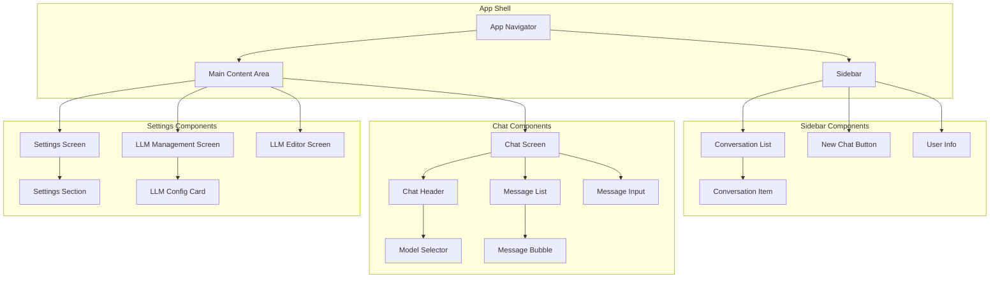
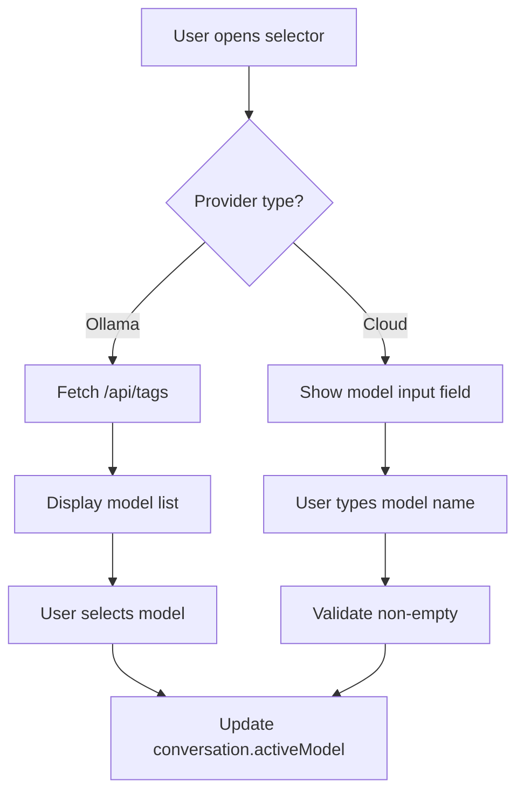
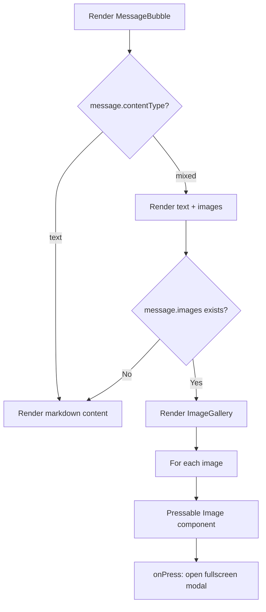

# LLM Hub - Component Breakdown

> Detailed responsibility matrix for all UI components in the LLM Hub application.

---

## 🗂️ Component Architecture Overview



---

## 🧭 Navigation Components

### AppNavigator

| Aspect | Details |
|--------|---------|
| **Location** | `/ui/navigation/AppNavigator.tsx` |
| **Responsibility** | Root navigation container managing sidebar + main content layout |
| **Platform Behavior** | Web: Sidebar always visible, collapsible<br>Mobile: Drawer navigation, swipe to open |
| **Dependencies** | React Navigation, `useSettingsStore` |

```typescript
interface AppNavigatorProps {
  // No props - root component
}

// Key behaviors:
// - Manages sidebar visibility state
// - Handles deep linking
// - Provides navigation context
```

---

### Sidebar

| Aspect | Details |
|--------|---------|
| **Location** | `/ui/components/sidebar/Sidebar.tsx` |
| **Responsibility** | Left panel containing conversation list and navigation |
| **State** | Collapsed state from settings, Active conversation |
| **Dependencies** | `useConversationStore`, `useSettingsStore` |

```typescript
interface SidebarProps {
  isCollapsed: boolean;
  onToggleCollapse: () => void;
  onNavigate: (screen: 'settings' | 'llm-management') => void;
}

// Child components:
// - NewChatButton (top)
// - ConversationList (scrollable middle)
// - UserInfo (bottom, fixed)
```

---

## 💬 Chat Components

### ChatScreen

| Aspect | Details |
|--------|---------|
| **Location** | `/ui/screens/ChatScreen.tsx` |
| **Responsibility** | Main chat interface, orchestrates message display and input |
| **State** | Current conversation, messages, streaming state |
| **Dependencies** | `useConversationStore`, `useLLMStore` |

```typescript
interface ChatScreenProps {
  conversationId?: string;  // From navigation params
}

// Key behaviors:
// - Load messages when conversation changes
// - Handle message sending
// - Show streaming response
// - Auto-scroll to latest message
```

---

### ChatHeader

| Aspect | Details |
|--------|---------|
| **Location** | `/ui/components/chat/ChatHeader.tsx` |
| **Responsibility** | Displays conversation title and LLM/model selector |
| **Dependencies** | `useConversationStore`, `useLLMStore` |

```typescript
interface ChatHeaderProps {
  conversation: Conversation | null;
  onChangeModel: (llmId: string, model: string) => void;
  onEditTitle: (title: string) => void;
}

// Features:
// - Editable title (tap to edit)
// - ModelSelector dropdown
// - Back button on mobile
```

---

### ModelSelector

| Aspect | Details |
|--------|---------|
| **Location** | `/ui/components/chat/ModelSelector.tsx` |
| **Responsibility** | Dropdown for selecting LLM provider and model |
| **Dependencies** | `useLLMStore` |

```typescript
interface ModelSelectorProps {
  selectedLLMId: string;
  selectedModel: string;
  onSelect: (llmId: string, model: string) => void;
}

// Behaviors:
// - Two-level dropdown: Provider → Model
// - Fetch models for Ollama on expand
// - Manual input for cloud providers
// - Show provider icons/badges
```

**Model Selection Logic:**



---

### MessageList

| Aspect | Details |
|--------|---------|
| **Location** | `/ui/components/chat/MessageList.tsx` |
| **Responsibility** | Virtualized list of messages |
| **Dependencies** | None (pure presentation) |

```typescript
interface MessageListProps {
  messages: Message[];
  streamingContent?: string;
  isLoading: boolean;
}

// Optimizations:
// - FlatList with virtualization
// - Inverted list for auto-scroll
// - Memoized message items
```

---

### MessageBubble

| Aspect | Details |
|--------|---------|
| **Location** | `/ui/components/chat/MessageBubble.tsx` |
| **Responsibility** | Single message display with role-based styling, supports text and images |
| **Dependencies** | None (pure presentation) |

```typescript
interface MessageBubbleProps {
  message: Message;
  showLLMBadge?: boolean;  // Show which LLM generated
}

// Features:
// - Markdown rendering for text content
// - Image gallery for generated images (contentType: 'mixed')
// - Different styles for user/assistant/system
// - LLM badge showing provider + model
// - Timestamp on hover/tap
// - Copy button (text content)
// - Image actions: view fullscreen, download, copy URL
```

**Image Rendering Logic:**



**Sub-component: ImageGallery**

```typescript
interface ImageGalleryProps {
  images: MessageImage[];
  onImagePress: (image: MessageImage) => void;
}

// Features:
// - Grid layout for multiple images
// - Loading placeholder
// - Error state for failed loads
// - Tap to view fullscreen
```

---

### MessageInput

| Aspect | Details |
|--------|---------|
| **Location** | `/ui/components/chat/MessageInput.tsx` |
| **Responsibility** | Text input with send/stop buttons |
| **Dependencies** | None (controlled component) |

```typescript
interface MessageInputProps {
  value: string;
  onChange: (text: string) => void;
  onSend: () => void;
  onStop: () => void;
  isStreaming: boolean;
  disabled: boolean;
}

// Features:
// - Auto-grow textarea
// - Send on Enter (Shift+Enter for newline)
// - Stop button during streaming
// - Disabled state when no LLM selected
```

---

## 📋 Sidebar Components

### ConversationList

| Aspect | Details |
|--------|---------|
| **Location** | `/ui/components/sidebar/ConversationList.tsx` |
| **Responsibility** | Scrollable list of conversations |
| **Dependencies** | `useConversationStore` |

```typescript
interface ConversationListProps {
  conversations: Conversation[];
  selectedId: string | null;
  onSelect: (id: string) => void;
  onDelete: (id: string) => void;
}
```

---

### ConversationItem

| Aspect | Details |
|--------|---------|
| **Location** | `/ui/components/sidebar/ConversationItem.tsx` |
| **Responsibility** | Single conversation row |
| **Dependencies** | None (pure presentation) |

```typescript
interface ConversationItemProps {
  conversation: Conversation;
  isSelected: boolean;
  onPress: () => void;
  onDelete: () => void;
}

// Features:
// - Title display (truncated)
// - Last updated time
// - Active LLM indicator
// - Swipe-to-delete on mobile
// - Context menu on web
```

---

### NewChatButton

| Aspect | Details |
|--------|---------|
| **Location** | `/ui/components/sidebar/NewChatButton.tsx` |
| **Responsibility** | Create new conversation |
| **Dependencies** | `useConversationStore` |

```typescript
interface NewChatButtonProps {
  onPress: () => void;
}
```

---

### UserInfo

| Aspect | Details |
|--------|---------|
| **Location** | `/ui/components/sidebar/UserInfo.tsx` |
| **Responsibility** | User area with settings access |
| **Dependencies** | None |

```typescript
interface UserInfoProps {
  onSettingsPress: () => void;
}

// MVP: Just settings button, no user account
```

---

## ⚙️ Settings Components

### SettingsScreen

| Aspect | Details |
|--------|---------|
| **Location** | `/ui/screens/SettingsScreen.tsx` |
| **Responsibility** | Main settings page with section list |
| **Dependencies** | `useSettingsStore`, `useNavigation` |

```typescript
// Sections:
// 1. General - Theme, Streaming toggle
// 2. LLM Settings - Link to LLM Management
// 3. Data - Export/Import buttons
```

---

### LLMManagementScreen

| Aspect | Details |
|--------|---------|
| **Location** | `/ui/screens/LLMManagementScreen.tsx` |
| **Responsibility** | List and manage LLM configurations |
| **Dependencies** | `useLLMStore` |

```typescript
// Features:
// - List of LLMConfigCards
// - Add new LLM button
// - Provider preset quick-add
```

---

### LLMEditorScreen

| Aspect | Details |
|--------|---------|
| **Location** | `/ui/screens/LLMEditorScreen.tsx` |
| **Responsibility** | Create/edit single LLM config |
| **Dependencies** | `useLLMStore` |

```typescript
interface LLMEditorScreenProps {
  configId?: string;  // Edit mode if provided
  presetProvider?: LLMProvider;  // Pre-fill with preset
}

// Form fields:
// - Name (text)
// - Provider (dropdown)
// - Base URL (text, pre-filled from preset)
// - API Key (secure text, optional for Ollama)
// - Default Model (text)
// - Custom Headers (key-value editor)
// - Test Connection button
```

---

### LLMConfigCard

| Aspect | Details |
|--------|---------|
| **Location** | `/ui/components/settings/LLMConfigCard.tsx` |
| **Responsibility** | Display single LLM config with edit/delete |
| **Dependencies** | None (pure presentation) |

```typescript
interface LLMConfigCardProps {
  config: LLMConfig;
  onEdit: () => void;
  onDelete: () => void;
  onToggleEnabled: (enabled: boolean) => void;
  onTestConnection: () => void;
}

// Display:
// - Provider icon/badge
// - Name
// - Base URL (truncated)
// - Default model
// - Enabled toggle
// - Connection status indicator
```

---

### SettingsSection

| Aspect | Details |
|--------|---------|
| **Location** | `/ui/components/settings/SettingsSection.tsx` |
| **Responsibility** | Collapsible settings group |
| **Dependencies** | None (pure presentation) |

```typescript
interface SettingsSectionProps {
  title: string;
  children: React.ReactNode;
}
```

---

## 🧩 Common Components

### Button

```typescript
interface ButtonProps {
  title: string;
  onPress: () => void;
  variant: 'primary' | 'secondary' | 'danger' | 'ghost';
  size: 'sm' | 'md' | 'lg';
  disabled?: boolean;
  loading?: boolean;
  icon?: React.ReactNode;
}
```

### Input

```typescript
interface InputProps {
  value: string;
  onChangeText: (text: string) => void;
  placeholder?: string;
  label?: string;
  error?: string;
  secureTextEntry?: boolean;
  multiline?: boolean;
}
```

### Dropdown

```typescript
interface DropdownProps<T> {
  value: T;
  options: Array<{ label: string; value: T }>;
  onSelect: (value: T) => void;
  placeholder?: string;
  label?: string;
}
```

---

## 📱 Platform-Specific Behaviors

| Component | Web | Mobile |
|-----------|-----|--------|
| **Sidebar** | Always visible, collapsible | Drawer, swipe to open |
| **Message Input** | Enter to send, Shift+Enter newline | Send button only |
| **ConversationItem** | Right-click context menu | Swipe actions |
| **ModelSelector** | Hover dropdown | Modal picker |
| **Settings** | Full-width sections | Stacked cards |

---

## 🔄 Component → Store Mapping

| Component | Primary Store | Actions Used |
|-----------|---------------|--------------|
| ChatScreen | conversationStore | `loadMessages`, `sendMessage`, `cancelStreaming` |
| MessageInput | conversationStore | `sendMessage`, `cancelStreaming` |
| ChatHeader | conversationStore, llmStore | `setActiveLLM`, `updateConversationTitle` |
| ModelSelector | llmStore | `fetchModels`, `selectConfig` |
| Sidebar | conversationStore | `loadConversations`, `selectConversation` |
| ConversationList | conversationStore | `deleteConversation` |
| NewChatButton | conversationStore | `createConversation` |
| SettingsScreen | settingsStore | `updateSettings` |
| LLMManagementScreen | llmStore | `loadConfigs`, `deleteConfig` |
| LLMEditorScreen | llmStore | `createConfig`, `updateConfig`, `testConnection` |
