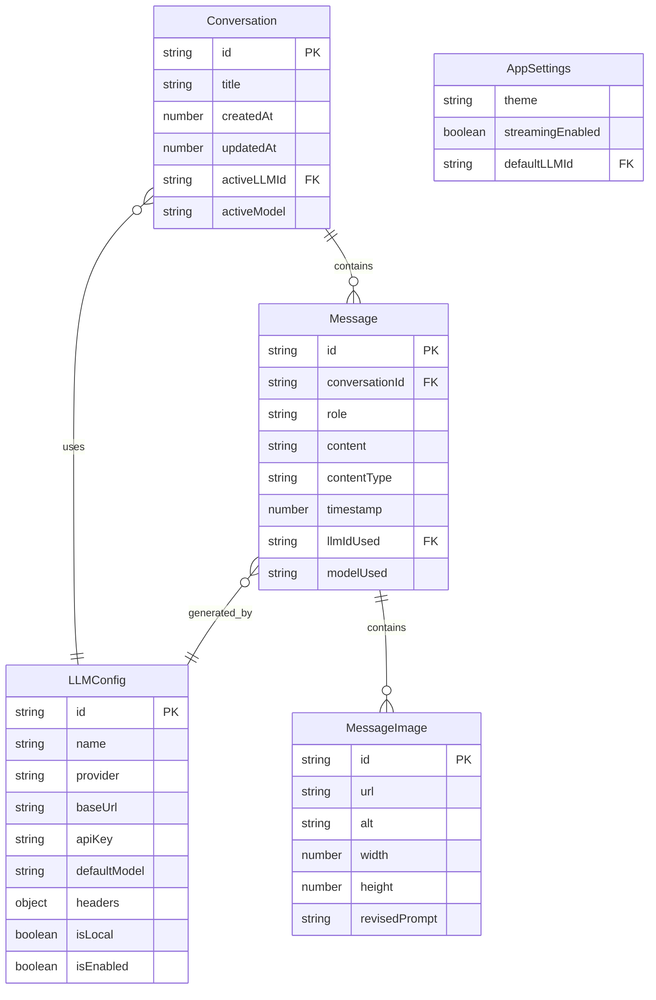

# LLM Hub - Data Models

> TypeScript interfaces for all core data entities in the LLM Hub application.

---

## 📊 Entity Relationship Diagram



---

## 💬 Conversation Model

```typescript
/**
 * Represents a chat conversation container.
 * A conversation holds multiple messages and tracks which LLM is currently active.
 */
interface Conversation {
  /** Unique identifier (UUID v4) */
  id: string;

  /** Display title - auto-generated from first message or user-defined */
  title: string;

  /** Unix timestamp (ms) when conversation was created */
  createdAt: number;

  /** Unix timestamp (ms) when conversation was last updated */
  updatedAt: number;

  /** Currently active LLM config ID for new messages */
  activeLLMId: string;

  /** Currently selected model for the active LLM */
  activeModel: string;
}
```

### Usage Notes
- `title` should be auto-generated from the first user message (first 50 chars) if not provided
- `activeLLMId` + `activeModel` determine what LLM/model future messages use
- Changing `activeLLMId` does not affect existing messages

---

## 📝 Message Model

```typescript
/**
 * Content type for messages
 */
type MessageContentType = 'text' | 'mixed';

/**
 * Image content within a message (for image generation responses)
 */
interface MessageImage {
  /** Unique identifier for the image */
  id: string;

  /** Image URL (remote) or base64 data URI */
  url: string;

  /** Alt text / description */
  alt?: string;

  /** Image dimensions if known */
  width?: number;
  height?: number;

  /** Revised prompt (if model modified the original prompt) */
  revisedPrompt?: string;
}

/**
 * Represents a single message within a conversation.
 * Each message tracks which LLM generated it for historical reference.
 * Supports both text and image content for image generation models.
 */
interface Message {
  /** Unique identifier (UUID v4) */
  id: string;

  /** Parent conversation ID */
  conversationId: string;

  /** Message author role */
  role: 'user' | 'assistant' | 'system';

  /** Message text content (markdown supported) */
  content: string;

  /** Content type: 'text' for text-only, 'mixed' for text + images */
  contentType: MessageContentType;

  /** Generated images (for image generation responses) */
  images?: MessageImage[];

  /** Unix timestamp (ms) when message was created */
  timestamp: number;

  /** LLM config ID that was used for this message (for assistant messages) */
  llmIdUsed: string;

  /** Specific model used for this message */
  modelUsed: string;

  /** Optional: Token usage statistics */
  usage?: TokenUsage;
}

/**
 * Token usage statistics for a message (optional tracking)
 */
interface TokenUsage {
  promptTokens?: number;
  completionTokens?: number;
  totalTokens?: number;
}
```

### Usage Notes
- User messages: `llmIdUsed` = the active LLM at time of sending (for context)
- Assistant messages: `llmIdUsed` = the LLM that generated the response
- System messages: Used for conversation context/instructions
- **Image responses**: Set `contentType: 'mixed'` and populate `images` array
- Image URLs can be remote (temporary) or base64 for local storage persistence

---

## 🤖 LLM Configuration Model

```typescript
/**
 * Supported LLM provider types
 */
type LLMProvider = 'openai' | 'anthropic' | 'ollama' | 'custom';

/**
 * Configuration for an LLM provider instance.
 * Users can have multiple configs for the same provider (e.g., different API keys)
 */
interface LLMConfig {
  /** Unique identifier (UUID v4) */
  id: string;

  /** User-friendly display name (e.g., "My OpenAI", "Local Ollama") */
  name: string;

  /** Provider type - determines API format */
  provider: LLMProvider;

  /** Base URL for API requests */
  baseUrl: string;

  /** API key (optional for local providers like Ollama) */
  apiKey?: string;

  /** Default model to use (e.g., "gpt-4", "claude-3-opus", "llama2") */
  defaultModel: string;

  /** Custom headers for API requests (e.g., org ID) */
  headers?: Record<string, string>;

  /** Whether this is a local provider (affects connectivity checks) */
  isLocal: boolean;

  /** Whether this config is enabled/visible in selector */
  isEnabled: boolean;

  /** Timestamp when config was created */
  createdAt: number;

  /** Timestamp when config was last modified */
  updatedAt: number;
}
```

---

## 🔧 Provider Presets

```typescript
/**
 * Default provider configurations.
 * Users can use these as templates or override any values.
 */
const PROVIDER_PRESETS: Record<LLMProvider, Partial<LLMConfig>> = {
  openai: {
    name: 'OpenAI',
    provider: 'openai',
    baseUrl: 'https://api.openai.com/v1',
    defaultModel: 'gpt-4o',
    isLocal: false,
  },

  anthropic: {
    name: 'Anthropic',
    provider: 'anthropic',
    baseUrl: 'https://api.anthropic.com/v1',
    defaultModel: 'claude-3-5-sonnet-20241022',
    isLocal: false,
  },

  ollama: {
    name: 'Ollama (Local)',
    provider: 'ollama',
    baseUrl: 'http://localhost:11434',
    defaultModel: 'llama2',
    isLocal: true,
    // No API key required
  },

  custom: {
    name: 'Custom Provider',
    provider: 'custom',
    baseUrl: '',
    defaultModel: '',
    isLocal: false,
  },
};
```

---

## ⚙️ App Settings Model

```typescript
/**
 * Theme options for the app
 */
type ThemeMode = 'light' | 'dark' | 'system';

/**
 * Global application settings.
 * Persisted in local storage.
 */
interface AppSettings {
  /** Current theme mode */
  theme: ThemeMode;

  /** Enable streaming responses (SSE) */
  streamingEnabled: boolean;

  /** Default LLM config ID for new conversations */
  defaultLLMId: string | null;

  /** Sidebar collapsed state (web) */
  sidebarCollapsed: boolean;

  /** Last app version (for migrations) */
  lastAppVersion: string;
}

/**
 * Default settings for fresh installs
 */
const DEFAULT_SETTINGS: AppSettings = {
  theme: 'system',
  streamingEnabled: true,
  defaultLLMId: null,
  sidebarCollapsed: false,
  lastAppVersion: '1.0.0',
};
```

---

## 📤 Export/Import Types

```typescript
/**
 * Format for exporting conversations (JSON)
 */
interface ExportedData {
  /** Export format version for forward compatibility */
  version: string;

  /** Export timestamp */
  exportedAt: number;

  /** Exported conversations with their messages */
  conversations: Array<{
    conversation: Conversation;
    messages: Message[];
  }>;

  /** LLM configs (without API keys for security) */
  llmConfigs: Array<Omit<LLMConfig, 'apiKey'>>;
}
```

---

## 🔗 State Store Types

```typescript
/**
 * Conversation store state shape
 */
interface ConversationStoreState {
  conversations: Conversation[];
  currentConversationId: string | null;
  messages: Record<string, Message[]>; // Keyed by conversationId

  // Loading states
  isLoadingConversations: boolean;
  isSendingMessage: boolean;
  isStreaming: boolean;

  // Streaming state
  streamingContent: string;
}

/**
 * LLM store state shape
 */
interface LLMStoreState {
  configs: LLMConfig[];
  selectedConfigId: string | null;

  // Model fetching (for Ollama)
  availableModels: Record<string, string[]>; // Keyed by configId
  isLoadingModels: boolean;
}

/**
 * Settings store state shape
 */
interface SettingsStoreState {
  settings: AppSettings;
  isLoading: boolean;
}
```

---

## 📏 Validation Rules

| Field | Rule |
|-------|------|
| `Conversation.title` | Max 200 characters |
| `Message.content` | Max 100,000 characters |
| `LLMConfig.name` | Required, max 50 characters |
| `LLMConfig.baseUrl` | Required, valid URL format |
| `LLMConfig.apiKey` | Required for cloud providers |
| `LLMConfig.defaultModel` | Required, non-empty |

---

## 🔄 ID Generation

```typescript
/**
 * Generate unique identifiers using UUID v4
 * Using a lightweight implementation for cross-platform compatibility
 */
const generateId = (): string => {
  return 'xxxxxxxx-xxxx-4xxx-yxxx-xxxxxxxxxxxx'.replace(/[xy]/g, (c) => {
    const r = (Math.random() * 16) | 0;
    const v = c === 'x' ? r : (r & 0x3) | 0x8;
    return v.toString(16);
  });
};
```
