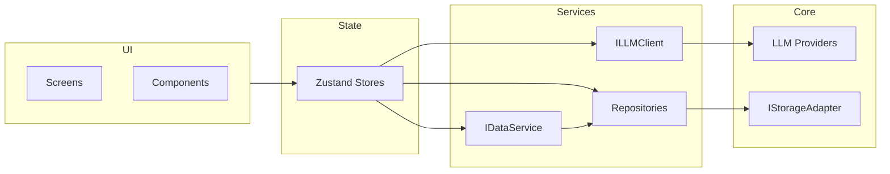

# LLM Hub - Service Interfaces

> Core service contracts and abstraction layer interfaces for the LLM Hub application.

---

## 🤖 LLM Client Interface

The LLM Client is the **central abstraction** that hides provider-specific implementations from the rest of the application.

### Core Interface

```typescript
/**
 * Message format for LLM requests
 */
interface ChatMessage {
  role: 'user' | 'assistant' | 'system';
  content: string;
}

/**
 * Request parameters for LLM completion
 */
interface LLMRequest {
  /** LLM configuration to use */
  llmConfig: LLMConfig;

  /** Conversation messages (including system prompt if any) */
  messages: ChatMessage[];

  /** Model to use (overrides config default if provided) */
  model?: string;

  /** Enable streaming response */
  stream?: boolean;

  /** Optional: Temperature (0-2) */
  temperature?: number;

  /** Optional: Max tokens for response */
  maxTokens?: number;

  /** AbortController signal for cancellation */
  signal?: AbortSignal;
}

/**
 * Generated image in response (for image generation models like DALL-E)
 */
interface LLMResponseImage {
  /** Image URL (temporary, from provider) */
  url: string;

  /** Base64 encoded image (if requested) */
  b64_json?: string;

  /** Revised prompt (if model modified the original) */
  revisedPrompt?: string;
}

/**
 * Non-streaming response from LLM
 */
interface LLMResponse {
  /** Response message content */
  content: string;

  /** Model that generated the response */
  model: string;

  /** Generated images (for image generation models) */
  images?: LLMResponseImage[];

  /** Token usage statistics */
  usage?: {
    promptTokens: number;
    completionTokens: number;
    totalTokens: number;
  };

  /** Provider-specific metadata */
  metadata?: Record<string, unknown>;
}

/**
 * Streaming chunk from LLM
 */
interface LLMStreamChunk {
  /** Content delta */
  content: string;

  /** Whether this is the final chunk */
  done: boolean;

  /** Final usage stats (only on last chunk) */
  usage?: LLMResponse['usage'];
}

/**
 * Main LLM Client Interface
 * All provider implementations must conform to this interface
 */
interface ILLMClient {
  /**
   * Send a chat completion request (non-streaming)
   */
  sendMessage(request: LLMRequest): Promise<LLMResponse>;

  /**
   * Send a streaming chat completion request
   * Returns an async generator for streaming chunks
   */
  sendMessageStream(
    request: LLMRequest
  ): AsyncGenerator<LLMStreamChunk, void, unknown>;

  /**
   * Fetch available models from the provider
   * (Primarily useful for Ollama; cloud providers return hardcoded lists)
   */
  fetchModels(llmConfig: LLMConfig): Promise<string[]>;

  /**
   * Test connection to the provider
   */
  testConnection(llmConfig: LLMConfig): Promise<boolean>;
}
```

---

## 🏭 LLM Provider Factory

```typescript
/**
 * Factory for creating provider-specific LLM clients
 */
interface ILLMClientFactory {
  /**
   * Get an LLM client for the given configuration
   * Returns the appropriate provider implementation based on config.provider
   */
  getClient(config: LLMConfig): ILLMClient;
}

/**
 * Implementation outline
 */
class LLMClientFactory implements ILLMClientFactory {
  private clients: Map<LLMProvider, ILLMClient> = new Map();

  getClient(config: LLMConfig): ILLMClient {
    switch (config.provider) {
      case 'openai':
        return this.getOrCreate('openai', () => new OpenAIProvider());
      case 'anthropic':
        return this.getOrCreate('anthropic', () => new AnthropicProvider());
      case 'ollama':
        return this.getOrCreate('ollama', () => new OllamaProvider());
      case 'custom':
        // Custom uses OpenAI-compatible format by default
        return this.getOrCreate('openai', () => new OpenAIProvider());
      default:
        throw new Error(`Unknown provider: ${config.provider}`);
    }
  }

  private getOrCreate(
    key: LLMProvider,
    factory: () => ILLMClient
  ): ILLMClient {
    if (!this.clients.has(key)) {
      this.clients.set(key, factory());
    }
    return this.clients.get(key)!;
  }
}
```

---

## 🔌 Provider Implementation Interface

```typescript
/**
 * Abstract base class for LLM providers
 */
abstract class BaseLLMProvider implements ILLMClient {
  /**
   * Build headers for API requests
   */
  protected abstract buildHeaders(config: LLMConfig): Record<string, string>;

  /**
   * Build the request body for chat completions
   */
  protected abstract buildRequestBody(
    messages: ChatMessage[],
    model: string,
    stream: boolean
  ): Record<string, unknown>;

  /**
   * Get the chat completions endpoint
   */
  protected abstract getCompletionsEndpoint(config: LLMConfig): string;

  /**
   * Parse the non-streaming response
   */
  protected abstract parseResponse(data: unknown): LLMResponse;

  /**
   * Parse a streaming chunk
   */
  protected abstract parseStreamChunk(chunk: string): LLMStreamChunk | null;

  /**
   * Parse the models list response
   */
  protected abstract parseModels(data: unknown): string[];

  // Common implementation for sendMessage, sendMessageStream, etc.
  // Subclasses only need to implement the abstract methods above
}
```

---

## 📦 Storage Interfaces

### Storage Adapter

```typescript
/**
 * Low-level storage interface
 * Abstracts AsyncStorage (mobile) and localStorage (web)
 */
interface IStorageAdapter {
  /**
   * Get a value by key
   */
  get<T>(key: string): Promise<T | null>;

  /**
   * Set a value by key
   */
  set<T>(key: string, value: T): Promise<void>;

  /**
   * Remove a value by key
   */
  remove(key: string): Promise<void>;

  /**
   * Get all keys matching a prefix
   */
  getKeys(prefix: string): Promise<string[]>;

  /**
   * Clear all data
   */
  clear(): Promise<void>;
}
```

---

### Repository Interfaces

```typescript
/**
 * Base repository interface for CRUD operations
 */
interface IRepository<T, ID = string> {
  findById(id: ID): Promise<T | null>;
  findAll(): Promise<T[]>;
  create(entity: T): Promise<T>;
  update(entity: T): Promise<T>;
  delete(id: ID): Promise<void>;
}

/**
 * Conversation repository
 */
interface IConversationRepository extends IRepository<Conversation> {
  /**
   * Find conversations ordered by update time (most recent first)
   */
  findAllSorted(): Promise<Conversation[]>;

  /**
   * Search conversations by title
   */
  search(query: string): Promise<Conversation[]>;

  /**
   * Update just the updatedAt timestamp
   */
  touch(id: string): Promise<void>;
}

/**
 * Message repository
 */
interface IMessageRepository extends IRepository<Message> {
  /**
   * Find all messages for a conversation
   */
  findByConversationId(conversationId: string): Promise<Message[]>;

  /**
   * Find messages ordered by timestamp
   */
  findByConversationIdSorted(conversationId: string): Promise<Message[]>;

  /**
   * Delete all messages for a conversation
   */
  deleteByConversationId(conversationId: string): Promise<void>;

  /**
   * Batch create messages (for import)
   */
  createBatch(messages: Message[]): Promise<Message[]>;
}

/**
 * LLM Config repository
 */
interface ILLMConfigRepository extends IRepository<LLMConfig> {
  /**
   * Find all enabled configs
   */
  findEnabled(): Promise<LLMConfig[]>;

  /**
   * Find configs by provider type
   */
  findByProvider(provider: LLMProvider): Promise<LLMConfig[]>;
}

/**
 * Settings repository
 */
interface ISettingsRepository {
  /**
   * Get current settings
   */
  get(): Promise<AppSettings>;

  /**
   * Update settings (partial update)
   */
  update(settings: Partial<AppSettings>): Promise<AppSettings>;

  /**
   * Reset to defaults
   */
  reset(): Promise<AppSettings>;
}
```

---

## 📤 Export/Import Service

```typescript
/**
 * Service for data export and import
 */
interface IDataService {
  /**
   * Export all conversations and configs to JSON
   */
  exportAll(): Promise<ExportedData>;

  /**
   * Export specific conversations
   */
  exportConversations(conversationIds: string[]): Promise<ExportedData>;

  /**
   * Import data from JSON
   * @param mode 'merge' | 'replace' - how to handle existing data
   */
  import(data: ExportedData, mode: 'merge' | 'replace'): Promise<ImportResult>;

  /**
   * Validate import data format
   */
  validateImport(data: unknown): data is ExportedData;
}

interface ImportResult {
  success: boolean;
  conversationsImported: number;
  messagesImported: number;
  configsImported: number;
  errors: string[];
}
```

---

## 🔄 Sync Service (Stub)

```typescript
/**
 * Future sync service interface (MVP: stub only)
 * Prepared for future cloud sync capability
 */
interface ISyncService {
  /**
   * Sync status
   */
  readonly status: 'idle' | 'syncing' | 'error' | 'disabled';

  /**
   * Last sync timestamp
   */
  readonly lastSyncAt: number | null;

  /**
   * Enable/disable sync (MVP: always disabled)
   */
  setEnabled(enabled: boolean): Promise<void>;

  /**
   * Trigger manual sync (MVP: no-op)
   */
  sync(): Promise<void>;
}

/**
 * Stub implementation for MVP
 */
class SyncServiceStub implements ISyncService {
  readonly status = 'disabled' as const;
  readonly lastSyncAt = null;

  async setEnabled(_enabled: boolean): Promise<void> {
    console.log('Sync not implemented in MVP');
  }

  async sync(): Promise<void> {
    console.log('Sync not implemented in MVP');
  }
}
```

---

## 🎯 State Store Interfaces

```typescript
/**
 * Conversation store actions
 */
interface ConversationStoreActions {
  // Conversation CRUD
  loadConversations(): Promise<void>;
  createConversation(llmId?: string): Promise<Conversation>;
  selectConversation(id: string | null): Promise<void>;
  deleteConversation(id: string): Promise<void>;
  updateConversationTitle(id: string, title: string): Promise<void>;

  // Messaging
  loadMessages(conversationId: string): Promise<void>;
  sendMessage(content: string): Promise<void>;
  cancelStreaming(): void;

  // LLM selection
  setActiveLLM(llmId: string, model: string): Promise<void>;
}

/**
 * LLM store actions
 */
interface LLMStoreActions {
  loadConfigs(): Promise<void>;
  createConfig(config: Omit<LLMConfig, 'id' | 'createdAt' | 'updatedAt'>): Promise<LLMConfig>;
  updateConfig(config: LLMConfig): Promise<void>;
  deleteConfig(id: string): Promise<void>;
  selectConfig(id: string): void;
  fetchModels(configId: string): Promise<string[]>;
  testConnection(configId: string): Promise<boolean>;
}

/**
 * Settings store actions
 */
interface SettingsStoreActions {
  loadSettings(): Promise<void>;
  updateSettings(settings: Partial<AppSettings>): Promise<void>;
  resetSettings(): Promise<void>;
}
```

---

## 🔒 Error Handling

```typescript
/**
 * Custom error types for better error handling
 */
class LLMError extends Error {
  constructor(
    message: string,
    public readonly code: LLMErrorCode,
    public readonly provider: LLMProvider,
    public readonly cause?: Error
  ) {
    super(message);
    this.name = 'LLMError';
  }
}

enum LLMErrorCode {
  NETWORK_ERROR = 'NETWORK_ERROR',
  AUTH_ERROR = 'AUTH_ERROR',
  RATE_LIMIT = 'RATE_LIMIT',
  INVALID_REQUEST = 'INVALID_REQUEST',
  MODEL_NOT_FOUND = 'MODEL_NOT_FOUND',
  CONTEXT_LENGTH_EXCEEDED = 'CONTEXT_LENGTH_EXCEEDED',
  SERVER_ERROR = 'SERVER_ERROR',
  TIMEOUT = 'TIMEOUT',
  CANCELLED = 'CANCELLED',
  UNKNOWN = 'UNKNOWN',
}

class StorageError extends Error {
  constructor(
    message: string,
    public readonly operation: 'read' | 'write' | 'delete',
    public readonly cause?: Error
  ) {
    super(message);
    this.name = 'StorageError';
  }
}
```

---

## 📊 Dependency Graph


